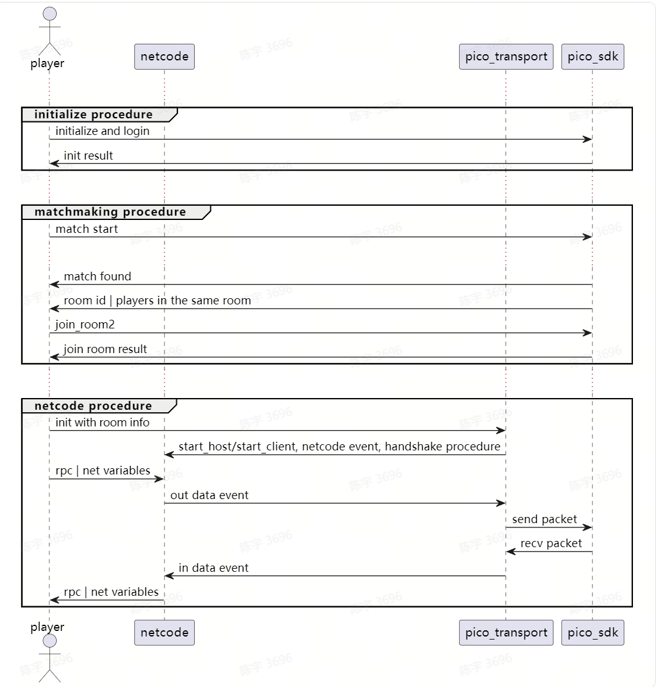

# PicoTransport
## 1.  Overview
The PicoTransport module implements the INetworkTransport interface for Netcode, facilitating the integration between Netcode and PICO room services.  
By utilizing PicoTransport, developers can leverage Netcode and PICO room services to develop multiplayer PICO applications. The overall structure is illustrated below:    

## 2. Preparation
### 2.1. PICO VR Environment Setup
- Follow the["Quick Start"](https://developer-global.pico-interactive.com/document/unity/) section in the PICO official documentation to set up the basic PICO VR environment and create a new VR project.  
  
>PICO relies on some preview packages, such as 'XR Interaction Toolkit'. Please enable the preview package option to install these packages as shown in the following image:  
>  
>To work around the bug in the PICO Unity Integration SDK v2.x.x that causes the failure to retrieve PICO user information when running in the Unity Editor, you can temporarily comment out the call to CLIB.ppf_User_GetPresenceIsJoinable in the User.cs script located in PICO.Platform/Platform/Scripts/Models at line 85. This will bypass the bug and allow you to proceed with the examples.  

### 2.2. PICO Multiplayer Service Activation  
- Apply for a developer account on the [PICO platform](https://developer-global.pico-interactive.com/) and create an app. 
- After creating the app, activate the PICO matchmaking(room) services for this app:  
  
- Create a PICO matchmaking pool as needed in the 'Matchmaking Service' section.  
>To run the included examples, **it is essential to create a matchmaking pool named 'test_pool_basic_2' and set the options 'Managed Rooms' and 'Allow Matching Into the Same Room' as shown in the image below**:    
>  

### 2.3. Unity Project Configuration  
Configure the 'PICO Platform' and 'PC Debug' settings:  
  
- Disable the 'UserEntitlementCheck' option in the platform SDK settings ('PXR_SDK' > 'Platform Settings'):  
  
- Set the Access Token in the 'PC Debug' settings ('PXR_SDK' > 'PC Debug Settings')::  
   
Retrieve the Access Token from the [PICO Developer Dashboard](https://developer-global.pico-interactive.com/):
  
- After making the configuration changes, close and reopen the Unity Editor (required for PICO PC Debug)  

## 3. Quick Start
### 3.1 Example Features
The 'SimpleMode' example is derived from the netcode goldenpath and is designed to synchronize capsule representations of different clients on PICO devices. This example utilizes the PICO Platform services and PicoTransport. Specifically, the participating clients join the same PICO named room and use the PICO Platform's message sending and receiving API to achieve Netcode communication.  

### 3.2 Import PicoTransport and Example Project
Download the PicoTransport package and save it locally. Then, in the Unity Editor, go to the menu 'Windows' > 'Package Manager'.  
In the Package Manager window, click on '+' > 'Add package from disk'.    
  
Select the PicoTransport directory that was downloaded, and choose the package.json file to import PicoTransport. After importing PicoTransport, proceed to import the Samples into the project as well.    
 

### 3.3 Run the SimpleMode Example  
#### 3.3.1. Run in the Editor
- Open the 'SimpleMode' scene:  
  
- Make sure the necessary configurations are set in the Unity Editor:  
  
- Click the 'Play' button to run the scene and add the current scene to the build scenes when prompted 
  
- Click the 'StartRoom' button (or the 'StartHost' button in the NetworkManager component) to spawn a red capsule in the scene. This indicates that the Netcode host is running successfully. Click the 'Move' button to randomly move the capsule representing the host:  
  
To test the interaction between two Netcode clients, let's proceed with the following steps to build an instance for running on a PICO device.  

#### 3.3.2. Build and Run on a PICO Device  
- In the Unity Editor, go to the menu and select 'File' > 'Build Settings...'. In the build settings window, remove the basic XR scene added during the preparation step and check only the 'SampleMode' scene: 
    
- Switch the platform to Android (ensure that the platform settings match the instructions in the [Quick Start](https://developer-global.pico-interactive.com/document/unity/) section of the official PICO documentation).  
In the Android tab, click on 'Switch Platform' to switch to the Android platform. If the location indicated by the red box shows 'Build', it means the current platform is already set to Android and there is no need to switch.  
  
- Connect your PICO device and select it in the 'Run Device' dropdown menu. Click on 'Build And Run'. When prompted to specify the output directory for the generated APK, create a new 'output' folder to store it.
  

#### 3.3.3. Unity Editor and PICO Device Debugging  
After the 'Build And Run' process is complete, you can start debugging between the PICO device and the Unity Editor.   
Put on the PICO device and click the 'Join Room' button. The PICO device will join the room created by the Editor (the room name in the example is 'abc'). Two red capsules will appear in the room, one representing the host in the Editor and the other representing the client on the PICO device. Click the 'Move' button in the Editor or on the PICO device to see the capsule positions synchronized between the Editor and the PICO device:  
  
>If there is an initialization failure on the device with a message stating "Signature Mismatch," you can upload the APK package to the PICO developer platform to sync the signature information.   
>Note: When the PICO device screen is off, the Netcode logic also stops. Therefore, if the PICO device acts as the host of the room ('Start Room'), make sure the PICO app is awake when the client moves. This way, the host remains active and can handle the Netcode synchronization messages sent by the client.  

### 3.4 Other Examples
#### 3.4.1 MatchmakingRoom
The 'MatchmakingRoom' example differs from the 'SimpleMode' example in the following ways:  
- In the 'SimpleMode' scene, there is no matchmaking process. The clients join the same PICO named room by using a pre-agreed room name. In the 'Matchmaking' scene, the clients gather together through PICO's matchmaking service and then join the same PICO matchmaking room.  
- Since the 'SimpleMode' scene does not require a matchmaking process, PicoTransport operates in "Simple Mode" where it encapsulates the process of creating and joining rooms internally. Developers do not need to worry about the specific calls to PICO.CoreService/PICO.GameService, but only need to configure the agreed room name.   
On the other hand, in the 'MatchmakingRoom' scene, developers explicitly call PICO's Platform service APIs for matchmaking and joining the room. In the 'Matchmaking' scene, PicoTransport works in "External Room" mode because it needs to interact with the PICO room managed by the developer. For a more detailed comparison between the "Simple" and "External Room" modes, refer to the [Working Modes](#41-working-modes) section in the PicoTransport documentation.    
#####  Running the MatchmakingRoom Example  
  - Build this scene to your PICO device, selecting only the 'MatchmakingRoom' scene during the build process:    
  
  - Run it in the Unity Editor, click the 'InitPicoSDK' button, and it will initialize PICO internally and join the 'test_pool_basic_2' matchmaking pool configured in section [2.2](#22-pico-multiplayer-service-activation). After successfully joining the matchmaking pool, the UI will display the UID and wait for other clients to join:  
  
  - On the PICO device, click the 'InitPicoSDK' button to join the matchmaking pool. Since the matchmaking conditions are met, the PICO matchmaking service will match the client in the Editor with the client in the PICO device and create a matchmaking room for them to join. At this point, the UI will display the 'JoinRoom' button:    
  
  - Click the 'JoinRoom' button in both the Editor and on the PICO device to join the PICO matchmaking room. Once in the room, the position synchronization by NetCode will start, as shown in the following image. Click the 'Submit position' button to move the capsule and synchronize the positions between the two clients:  
  
>Note:   
>1. PICO's matchmaking rooms have a time limit. If both sides don't click 'JoinRoom' to join the room, the room will be destroyed on the PICO server after 10 seconds. After that, any attempt to join the room will fail, and you will be returned to the initial interface.  
>2. When a Netcode client joins, it needs to handshake with the host before starting the normal synchronization communication process. Therefore, if the client clicks 'JoinRoom' before the host joins the room, the client will be stuck in the room interface. The reason is that the host has not joined the room yet and cannot handle the messages sent by the client. Only when the host also clicks 'JoinRoom', the handshake between the two Netcode clients can be completed, and the red capsules representing both sides will be created, starting the normal communication and synchronization process. 

#### 3.4.2 Multiplayer  
The 'Multiplayer' example is similar to the 'MatchmakingRoom' example. In the 'Multiplayer' scene, PicoTransport also works in "External Room" mode and uses PICO's matchmaking service to gather together. Compared to 'MatchmakingRoom', 'Multiplayer' synchronizes more information, such as player actions, making it a more realistic example.  
##### Running the Multiplayer Example  
- Build this scene to your PICO device and run it, **making sure to add the 'Init', 'Start', and 'Fight' scenes in order (indices 0/1/2)**:  
  
- Run it in the Unity Editor and click the 'Start' button to start the matchmaking process:  
  
After successfully joining the matchmaking, it will display 'InMatching...' to indicate that it is waiting for other players to join:  
  
- On the PICO device, click the 'Start' button to join the matchmaking. Since the matchmaking conditions are met, the PICO matchmaking service will match the client in the Editor with the client in the PICO device and create a matchmaking room. Once both clients enter this matchmaking room, the position synchronization for NetCode will start. Move to the green area on the right to exit the current scene:  
  

### 3.5 Behavior in Special Scenarios
Two factors can affect the behavior in weak network conditions: 1. The host/server-centric topology of NetCode; 2. How PICO rooms handle player disconnections.  
#### 3.5.1 NetCode Factors:     
- NetCode relies on the host (owner of the PICO room) as the logical control center. The logic can only proceed when there is a host in the room. If a client joins the room before the host is ready, the client will be stuck waiting for the host.
- When the host leaves, the entire game session ends, and the client will also exit the game session.   
#### 3.5.2 PICO Room Factors:  
- When a client actively leaves a PICO room, the server immediately removes the player from the room (other players in the scene will see them leaving).  
- If a client stops sending heartbeats for more than 10 seconds (which can happen in poor network conditions), the server will remove the player from the PICO room.  
- If a PICO room is empty (no players) for more than 10 seconds, the room will be deleted, and any join requests to that room will fail.  
#### 3.5.3 Behavior in Examples:  
- After a successful match, if a client joins the room before the host, the client will not see any capsules in the scene because the handshake between the client and the host cannot be completed. Once the host joins, the handshake will be completed, and the capsules representing both sides will appear in the scene. If the host does not join within 10 seconds, the client will exit due to a handshake timeout.  
- If a client leaves the room but the host is still in the room, the client can rejoin the same room.  
- If the host leaves the room, the client will detect the host's departure and voluntarily exit the room.  
- If the host leaves the room, within 10 seconds the PICO server still keeps the room, and the host can rejoin the room.  
- If the room is empty for more than 10 seconds, the server will close the room. Any join requests from the host or clients will fail, and they will return to the initial interface.  
- In case of a network disconnection:  
  - If the connection is restored within 10 seconds, the logic will continue normally.  
  - If a client fails to reconnect within 10 seconds or keeps failing to reconnect:  
    - The timed-out client will return to the initial interface.  
    - The other clients still in the room will see the disconnected client leaving the scene if they were the host, or they will exit themselves if the disconnected client was the host. 

## 4. PicoTransport Usage Instructions  
### 4.1 Working Modes  
The application logic can be divided into two parts: the logic outside the room (including entering the room) and the logic inside the room.    
The logic outside the room does not involve NetCode. The purpose of this part of the logic is to gather players together and join them in the same PICO room so that they can exchange messages.    
The logic after entering the room, which is related to synchronization, needs to be supported by NetCode. In the room, PicoTransport acts as the communication layer for NetCode, responsible for supporting low-level message communication.  
PicoTransport has two working modes, 'SimpleMode' and 'ExternalRoom' mode, which are related to these two parts of the logic:    
- In 'SimpleMode', there is no logic outside the room. The developer only needs to set a common room name, and PicoTransport will handle the rest internally, including gathering suitable players together and joining them into the same PICO named room. In this mode, the PICO room is transparent to the developer.    
- In 'ExternalRoom' mode, the developer needs to handle the logic outside the room. This mode provides more flexibility, allowing the developer to control how players gather together, such as using friend invitations or matchmaking services, etc. However, the cost of this flexibility is more development work. The developer needs to handle the matching and joining process themselves and explicitly manage the room and handle message events inside the room. For PicoTransport, it is important that the developer forward messages and events between NetCode and the external room, as described in [Driving Transport in External Room Mode](#43-driving-picotransport-in-externalroom-mode).   

###  4.2 Using PicoTransport  

##### 4.2.1 Import and Use PicoTransport  
- Download the package to your local machine.  
- In the Unity Editor, go to 'Windows' > 'Package Manager'. In the Package Manager window, click on '+' > 'Add package from disk'.    
  
  Select the PicoTransport directory you just downloaded and choose the package.json file to import PicoTransport.
- After importing PicoTransport, import the samples as needed.  
  
- Set the 'Network Transport' of the NetworkManager to PicoTransport.  
  

##### 4.2.2 Configuring the PicoTransport Component  
- Simple Mode  
  In 'Simple' mode, developers only need to configure the PicoTransport component and do not need to write additional code to access the PICO platform services. The configuration options are as follows:  
  [simplemode-config](doc-images/simplemode-config.png)  

| Configuration Option      | Value | Description |
|---------|-----------|-----|
| WorkMode    | Simple | Select the Simple mode.|
| RoomName    | Room Name | Choose a room name that is appropriate for your business and notify all players in a suitable way. Internally, this configuration specifies the name of the named PICO room. |
| Password    | Room Password | The password for the named PICO room. If not set, the room will have no password.|

- External Room Mode  
  In 'ExternalRoom' mode, developers need to write code to call the various PICO platform services to join the PICO room, as well as receive and handle messages and events from the PICO room to drive the operation of PicoTransport. See [Driving Transport in External Room Mode](#43-driving-picotransport-in-externalroom-mode) for more details.  
  

| Configuration Option      | Value | Description |
|---------|-----------|-----|
| WorkMode    | External Room | Select the ExternalRoom mode.|  

### 4.3 Driving PicoTransport in ExternalRoom Mode  
  In contrast to 'SimpleMode', in 'ExternalRoom' mode, developers use the functionalities provided by the PICO SDK to create and manage PICO rooms. This process needs to be completed before calling Netcode's StartHost/StartClient.    
  After joining the PICO room, the client calls StartHost or StartClient to start Netcode. Developers need to do two things in their code:  
  - Forward the received room events and messages to PicoTransport.  
>Events: player enter and leave PICO room events, as well as the room player list.   
>Messages: Netcode messages from players in the same room.    
  - When PicoTransport needs to send messages, call the PICO room service API to send the message to the specified target player.      
    
To accomplish these two tasks, PicoTransport provides an adapter class called ExternalRoomTransportDriver. The main interfaces of this class are as follows:    

| Interface/Event      | Purpose | When to Call |  
|---------|-----------|-----|
| Init    | Initialize PicoTransport | After finding suitable players and successfully joining the same room. For example, in the OnComplete callback of PICO SDK's RoomService.Join2. |  
| HandleRoomInfoUpdate | Notify PicoTransport of the changes in the PICO room | When the room information changes, such as when someone enters the room. For example, in the callback set by RoomService.SetUpdateNotificationCallback.|  
| Update | Drive the process periodically | Called every frame. This function call HandleMsgFromRoom to receive messages from the PICO room and pass them to PicoTransport. | 
| OnDriverEvent | Event notification |Possible events include: Error, Shutdown, BeforeReenter/AfterReenter. BeforeReenter/AfterReenter are called before and after the previous host leaves and the client restarts Netcode. |  

>The logic outside the room is a prerequisite for the operation of the 'ExternalRoom' mode, but this logic is not included in PicoTransport.      
>In the PicoTransport example, a helper class called 'Netcode.Transports.Pico.ExternalModeSDKUser' is used.    
>This class encapsulates the initialization of the PICO platform SDK, token retrieval, PICO User retrieval, PICO Game service initialization, PICO matchmaking, entering the room, and other related APIs. It also registers callbacks to handle messages and events from the PICO services.  
>Developers can use ExternalModeSDKUser to call PICO services to complete the process of joining a room. They can also modify this class as needed to use other PICO platform service functionalities such as destination/RTC, etc.   

>Main interfaces of ExternalModeSDKUser::  
>| Interface Name      | Purpose |
>|---------|-----------|
>| StartPicoGame | Initialize the PICO platform, retrieve the access token, retrieve the logged-in user, and call game initialize. |
>| StartMatchmaking/StartJoinRoom/StartLeaveRoom | Join matchmaking, join room, leave room. |
>| StartNetcode/StopNetcode | Start Netcode. This function internally calls StartHost/StartClient of Netcode based on whether it is the PICO room host or not. |
>| OnStatusChange | Callback when the status changes, such as platform initialization completed, successful matchmaking, etc. |

### 4.4 Notes and Recommendations:
- If the host leaves the PICO room, the current Netcode session of all clients should end. However, in PICO, clients other than the original host remain in the PICO room without exiting. At this point, developers have two options:
  - Make these clients also exit the PICO room, ending the entire game. 
  - Let the new PICO room owner start StartHost, and other members in the room restart StartClient. This way, Netcode can be started again and the original game can continue. To do this, developers need to handle the host leaving event appropriately and save and restore the game state. PicoTransport provides some support for this by calling StartHost/StartClient again depending on whether it is the new PICO room owner or not. Please refer to the 'Multiplayer' code for more details. 
- PicoTransport internally handles the sending and receiving of messages within the PICO room. The business logic should not use the message sending and receiving functions of the PICO SDK's NetworkService. 
- To work around the bug in the PICO Unity Integration SDK v2.x.x that causes the failure to retrieve PICO user information when running in the Unity Editor, you can temporarily comment out the call to CLIB.ppf_User_GetPresenceIsJoinable in the User.cs script located in PICO.Platform/Platform/Scripts/Models at line 85. This will bypass the bug and allow you to proceed with the examples.  
 
