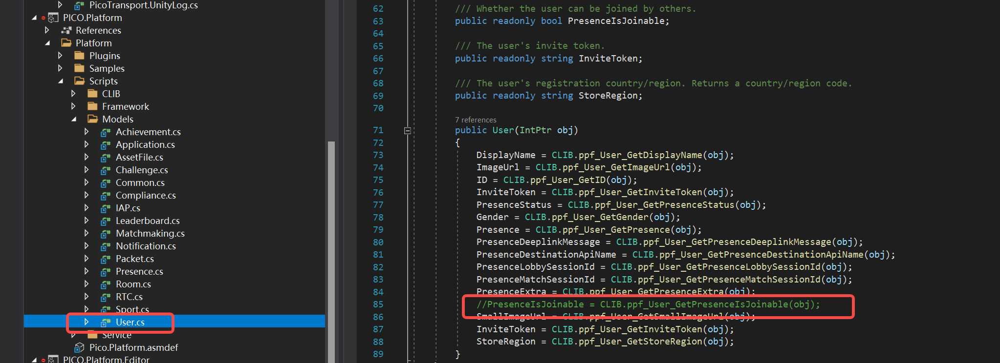
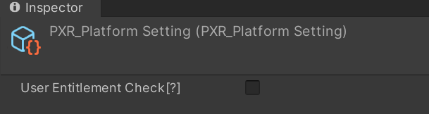
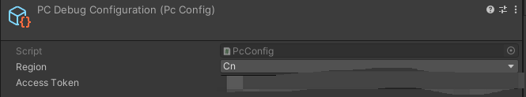
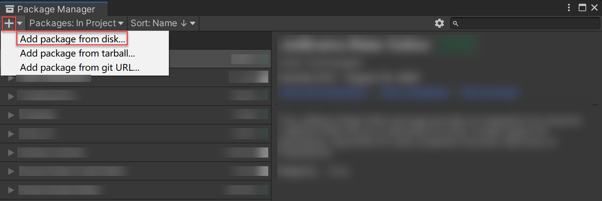
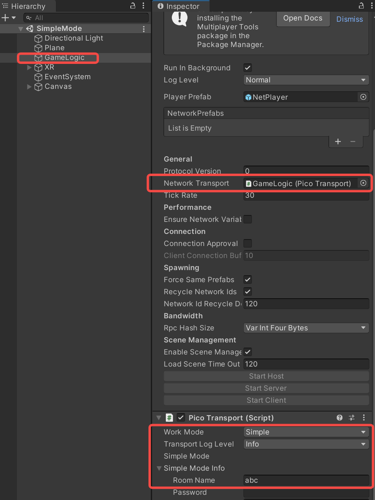
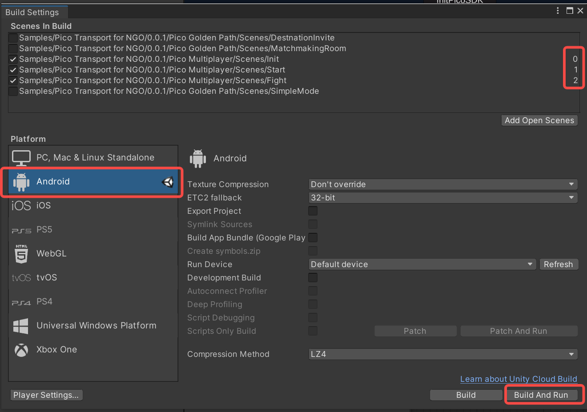
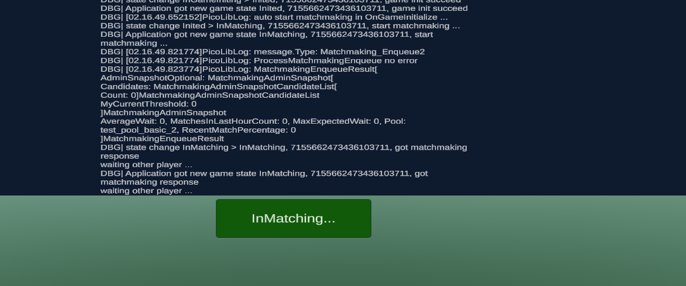

# PicoTransport说明
## 1.  概要介绍
PICO transport实现Netcode的INetworkTransport接口，完成Netcode和PICO房间服务的对接。  
通过PICO transport，开发者可以使用Netcode+PICO房间服务开发多人联网的PICO应用, 整体结构如下:  

## 2. 准备工作
### 2.1. PICO VR基本环境  
- 跟随PICO官方文档中的["快速开始"](https://developer-cn.pico-interactive.com/document/unity)一节, 完成基本的PICO VR环境设置，并新建一个VR项目  
  
>PICO依赖一些preview的package, 比如‘XR Interaction Toolkit’:，请打开preview package开关以安装这些package，如下图所示:  
> 
>在PICO Unity Integration SDK v2.x.x中有一个bug，该bug会导致在Unity Editor中运行时取PICO user信息失败。为了运行后续的例子，请临时注释掉对CLIB.ppf_User_GetPresenceIsJoinable的调用(PICO.Platform/Platform/Scripts/Models/User.cs:85)，以绕过此bug:  
 

### 2.2. PICO多人联网服务开通    
- 在[PICO平台](https://developer-cn.pico-interactive.com/)上申请开发者帐号，创建app
- 创建app后，开通此app的PICO匹配和房间服务:  
  
- 在'匹配服务'中按需新建PICO匹配池  
>为了运行附带的例子，**请务必创建一个名字为test_pool_basic_2的匹配池, 并设置‘管理房间'以及'允许多次匹配到此房间'选项**，如下图所示:    
>  

### 2.3. Unity工程中的配置  
- 配置PICO sdk以及PC Debug:  
  
- 在平台sdk设置('PXR_SDK' > 'Platform Settings')中取消选项'UserEntitlementCheck':  
  
- PC Debug设置Access Token('PXR_SDK'>'PC Debug Settings'):  
   
Access Token请从[PICO开发者平台](https://developer-cn.pico-interactive.com/)查询获取:
  
- 完成配置修改后，关闭并重新打开Unity Editor(PC Debug需要)

## 3. 快速开始
### 3.1 例子功能
SimpleMode例子修改自netcode goldenpath，功能是在PICO设备上同步代表不同客户端的胶囊体。该例子内部使用了PICO Platform服务和PicoTransport，具体而言: 参与方clients加入同一个PICO命名房间，而后使用PICO Platform的消息收发接口实现Netcode通信。

### 3.2 导入PICO transport和例子工程
下载Packageg保存至本地, 然后在Unity Editor中，从菜单栏选择'Windows' > 'Package Manager'  
在 Package Manager 窗口中，点击 '+' > 'Add package from disk'  

选择刚刚下载的PicoTransport目录，选中package.json导入PicoTransport。导入PicoTransport后，继续将Samples也导入工程。  

### 3.3 运行SimpleMode例子
#### 3.3.1. 在Editor中运行
- 至下图路径打开'SimpleMode'场景:  
  
- 在Unity Editor中确认相关配置如下:  
  
- 点击Play按钮运行场景，按提示将当前场景加入build scenes。
  
- 点击'StartRoom'按钮(或者NetworkManager组件中的StartHost按钮)，场景中出现一个红色胶囊，此时Netcode host已正常运行, 点击Move会随机移动代表host的胶囊:  
  
为了测试双人netcode交互，让我们再编译一个实例到PICO设备上，请按以下步骤继续操作。  

#### 3.3.2. 编译到PICO设备运行  
- Unity Editor菜单栏中选择'File' > 'Build Settings ...'，在build setting界面中，将之前准备工作中加入的基本XR场景移除，只勾选添加SampleMode场景: 
    
- 将平台切换至android(确保相关平台配置与[2.1](#21-pico-vr基本环境)节中的官方'快速开始'一节相符)。  
在Android页签中，点击'Switch Platform'切换至安卓平台，如果红框所示位置为'Build'，则当前已是Android平台，无需切换。  
  
- 连接PICO设备，在'Run Device'中选择自己的PICO设备，点击'Build And Run'。提示生成apk存放路径时，新建一个output目录存放。
  

#### 3.3.3. Unity Editor与PICO设备联调  
'Build And Run'结束后，可以开始PICO设备与Editor的联调。  
戴上PICO设备，点击'Join Room'按钮，此时PICO设备端会加入Editor建立的房间(例子中的房间名为'abc')，
房间中出现两个红色胶囊，一个为editor中的host，一个为PICO设备中的client。在Editor或PICO中点击'Move'按钮，可以看到胶囊位置在Editor和PICO设备间同步变化:  
  
>如果设备上初始化失败，提示“签名不一致”可以将 apk 包上传到开发者平台同步签名信息  
>注意: PICO设备熄屏时netcode逻辑也停止，所以如果是PICO设备作为host开启的房间('Start Room')，则client移动时要保证PICO上的app亮屏，这样，host处于运行状态，才能处理client发来的netcode同步消息  

### 3.4 其它例子
#### 3.4.1 MatchmakingRoom
MatchmakingRoom例子与SimpleMode例子的区别在于:  
- SimpleMode场景中没有匹配步骤，相关clients通过事先约定的房间名字，加入同一个PICO命名房间。而在Matchmaking场景中，clients是通过PICO的匹配服务聚集到一起，然后加入同一个PICO匹配房间。  
- 由于SimpleMode场景无需匹配过程，所以该场景中PicoTransport工作于'Simple Mode'模式，'Simple Mode'模式下PicoTransport内部封装了创建和进入房间的过程，开发者无需关心PICO.CoreService/PICO.GameService的具体调用，只配置约定的房间名字即可。  
  反之，在MatchmakingRoom场景中，开发者显式地调用PICO的Platform服务API进行匹配和进房间操作。在Matchmaking场景中，由于PicoTransport需要和开发者管理的PICO房间交互，所以该场景下的PicoTransport工作于'External Room'模式。‘Simple'和'External Room'两种模式的更详细区别参见[4.使用说明](#4-picotransport使用说明)一节。  
#####  运行MatchmakingRoom例子  
  - 编译该场景至PICO设备上，build时仅勾选‘MatchmakingRoom'场景:  
  
  - Editor中运行，点击'InitPicoSDK'按钮，此时内部会进行PICO的初始化，并将自身加入[2.2节](#22-pico多人联网服务开通)中配置的'test_pool_basic_2'匹配池。加入匹配池成功后，界面提示自身uid，并等待其它client加入匹配:  
  
  - 在PICO设备中，点击'InitPicoSDK'按钮，加入到匹配池中去。由于匹配条件满足，PICO匹配服务会将editor与PICO设备中的两个client匹配到一起，并创建匹配房间等待这两个client加入。此时界面显示'JoinRoom'按钮:  
  
  - 在Editor和PICO中分别点击JoinRoom加入PICO匹配房间。加入房间后会开始NetCode的位置同步，如下图所示。点击'Submit position'移动代表自身的胶囊，并在两个client间进行位置同步  
  
>注意:   
>1. PICO的匹配房间有保留时间限制，如果迟迟不点'JoinRoom'加入房间，则10秒后该房间会在PICO服务器侧销毁，此后再试图加入房间会失败，并回到初始界面。  
>2. Netcode的client加入时，需要与host握手，只有握手完成才能开始正常的同步通信过程。所以如果在host加入房间之前，client一侧先点了'JoinRoom'，则client会卡在房间内界面。其原因是, host还未加入房间，不能处理client发过来的消息, 只有等host也'JoinRoom'后，双方的netcode握手才能完成，代表双方的红色胶囊才会生成出来，并开始正常的通信同步。

#### 3.4.2 Multiplayer  
multiplayer例子与MatchmakingRoom类似，场景中PicoTransport也工作于'ExternalRoom'模式，并使用PICO的匹配服务聚集到一起。相比MatchmakingRoom，Multiplayer同步了更多的信息，比如玩家的动作，所以是一个更为实际些的例子。  
##### 运行Multiplayer例子  
- 编译该场景至PICO设备上并运行，**注意依次添加‘Init', 'Start'和'Fight'场景(序号0/1/2)**:  
  
- Editor中运行，点击'Start'按钮，开始加入匹配:  
  
加入匹配成功后，提示'InMatching...'，表示正在等待其它玩家参与匹配:  
  
- PICO设备中点击'Start'按钮以加入匹配  
此时，由于匹配条件满足，PICO匹配服务将editor与PICO中的两个client匹配到一起，创建匹配房间。双方client进入此匹配房间后，开始Netcode的移动同步。移动到右侧绿色区域可以离开当前场景：
  

### 3.5 特殊情况下的例子表现
有两方面因素会影响弱网情况下的表现: 1.Netcode以host/server为中心的拓扑结构; 2.PICO房间对玩家离开的处理;  
#### 3.5.1 Netcode因素:     
- netcode以host(PICO房间的owner)作为逻辑控制中心点，必须有host在房间内，逻辑才能正常进行。所以如果client先加入房间，而另一侧host还未准备好的话，则client会卡住并等待host
- netcode中host离开时，整个游戏session结束，此时client也将退出游戏session  
#### 3.5.2 PICO房间因素:  
- client主动退出PICO房间，服务器立刻将玩家从PICO房间中删去(场景中的其它人会看到其离开)  
- client停止心跳超过10秒(网络状况不佳时可能发生此情况)，服务器会将玩家从PICO房间中删去  
- PICO房间内空置(没有人)超过10秒, 此房间会删去，加入此房间的请求会失败  
#### 3.5.3 这两方面因素影响下的例子场景表现:  
- 匹配成功后，host尚未加入的情况下，client先'join room'，与host的netcode握手不能完成，场景中不会显示任何胶囊体。此后，在host也加入后，netcode的握手会完成，代表双方的胶囊体会出现在场景中。超过10秒host仍未进入，则10秒后client会因为握手超时退出  
- client离开房间但host还在房间中，client可以重新join回到该房间  
- host离开房间, client发现host离开后自己也主动退出  
- host离开房间，10秒内PICO服务器的房间仍存在，host可以重新加入房间  
- 房间空置超过10秒，服务器会关闭此房间，此时host/client的join room请求都会失败，回到初始界面  
- 网络断开时:  
  - 10秒内重连上，逻辑继续正常进行;  
  - client超过10秒重连上或者一直重连不上  
    - 超时的client自身：回到初始界面  
    - 另一侧网络正常的client端：如果对端为host，则自身退出; 如果对端为client，则会看到对方从场景中离开  

## 4. PicoTransport使用说明  
### 4.1 工作模式  
应用逻辑可分成两部分: 房间外逻辑(包括进房间)和房间内逻辑。  
房间外逻辑不涉及Netcode，这一部分逻辑的目的是将玩家聚集到一起并加入同一PICO房间，这样相关玩家之间才能够进行消息的收发。  
与Netcode有关的是进入房间以后的同步逻辑，这一部分逻辑需要由Netcode来支持。在房间内逻辑阶段中，PicoTransport作为Netcode的通信层，负责支持Netcode的底层消息通信。  
与这两部分逻辑相关，PicoTransport有两种工作模式: 'SimpleMode'和'ExternalRoom'模式:  
- 在'Simple'模式下，没有房间外逻辑。开发者只负责设定好一个共同的房间名字，其它逻辑都由PicoTransport在内部完成，包括: 将合适的玩家聚集到一起，将他们加入同一PICO命名房间等。在这一模式下，PICO房间对开发者透明。  
- 在'ExternalRoom'模式下，开发者需要负责房间外逻辑。该模式提供了更多的自由度，开发者可以控制玩家如何聚集到一起，比如使用好友邀请，或者使用匹配服务等等。但自由度的代价是开发工作量，开发者需要自行完成匹配和加入房间的过程，并且显式地管理房间和处理房间内的消息事件。对于PicoTransport，重要的是，开发者需要在Netcode与外部房间之间进行消息和事件的转发，具体见[4.3节](#43-externalroom模式下驱动picotransport工作)。 

###  4.2 使用PicoTransport  

##### 4.2.1 导入并使用PicoTransport  
- 下载Packageg至本地
- 在Unity Editor中，从菜单选择'Windows' > 'Package Manager'  
  在Package Manager窗口中，点击'+' > 'Add package from disk'  
  
  选择刚刚下载的PicoTransport目录，选中package.json导入PicoTransport
- 导入PicoTransport后，按需导入Samples  
  
- 将NetworkManager的transport设为PicoTransport  
  

##### 4.2.2 配置PicoTransport组件  
- Simple模式
  'Simple'模式中，开发者只需要配置PicoTransport组件，不需要额外写代码访问PICO platform服务。配置项如下:     
  

| 配置项      | 配置值 | 说明 |
|---------|-----------|-----|
| WorkMode    | Simple | 选择Simple模式|
| RoomName    | 房间名 | 由业务选择并以合适的方式通知给所有玩家，在内部，该配置指明named PICO room的名字 |
| Password    | 房间口令 | named PICO room的口令，如果不设置，则房间无口令|

- ExternalRoom模式  
  'ExternalRoom'模式中，开发者需要编写代码自行调用PICO平台各项服务以加入PICO房间，同时接收处理PICO房间的消息和事件，驱动PicoTransport运行，具体见[4.3节](#43-externalroom模式下驱动picotransport工作)。
  

| 配置项      | 配置值 | 说明 |
|---------|-----------|-----|
| WorkMode    | External Room | 选择'ExternalRoom'模式|  

### 4.3 ExternalRoom模式下驱动PicoTransport工作  
  与'SimpleMode'不同，在'ExternalRoom'模式时，开发者自行使用PICO SDK提供的功能创建PICO房间并管理，该过程需要在调用Netcode StartHost/StartClient之前完成。  
  加入PICO房间之后，client调用StartHost或者StartClient启动Netcode。Netcode运行过程中，开发者需要在代码中完成两件事:  
  - 将收到的房间变化信息和消息转给PicoTransport  
>事件包括: 玩家进入和离开PICO房间事件，以及房间玩家列表  
>消息包括: 来自同房间玩家的Netcode消息  
  - 在PicoTransport需要发送消息时，调用PICO房间服务接口把消息发给指定目标玩家    
    
为了完成这两件事，PicoTransport提供了适配类ExternalRoomTransportDriver, 该类的主要接口如下:  

| 接口/事件      | 作用 | 调用时机 |  
|---------|-----------|-----|
| Init    | 初始化PicoTransport | 找到合适的其它玩家，并一起成功加入同一房间之后 例如在PICO SDK RoomService.Join2的OnComplete中 |  
| HandleRoomInfoUpdate | 将PICO房间的信息变化通知给PicoTransport | 房间信息变化时，例如人员进入房间 例如在RoomService.SetUpdateNotificationCallback所设置的回调中调用 |  
| Update | 定时驱动 | 每帧反复调用 该函数内部调用HandleMsgFromRoom以接收PICO房间发来的消息并传给PicoTransport | 
| OnDriverEvent | 事件通知 |可能事件包括: Error、Shutdown、BeforeReenter/AfterReenter 其中BeforeReenter/AfterReenter在之前的host离开，client重新start netcode之前和之后被调用 |  

>房间外逻辑是‘ExternalRoom'模式工作的前提，但这部分逻辑不包含在PicoTransport中。    
>在PicoTransport例子中，使用了一个辅助类'Netcode.Transports.Pico.ExternalModeSDKUser'。  
>该类封装PICO platform SDK初始化，token获取，PICO User获取，PICO Game服务初始化，PICO匹配和进房间等等相关接口，同时注册了回调以处理来自PICO服务的消息与事件。
>开发者可以使用ExternalModeSDKUser来调用PICO服务以完成进房间流程，也可以按需修改此类，以使用其它PICO平台服务功能，比如destnation/RTC等等。 

>ExternalModeSDKUser的主要接口:  
>| 接口名      | 作用 |
>|---------|-----------|
>| StartPicoGame | 初始化PICO platform, 取access token, 取logged in user, 调用game initialize |
>| StartMatchmaking/StartJoinRoom/StartLeaveRoom | 加入匹配、加入房间、离开房间 |
>| StartNetcode/StopNetcode | 开始Netcode，该函数内部会根据自身是否为PICO房主，分别调用Netcode的StartHost/StartClient |
>| OnStatusChange | 状态发生变化时的回调，例如平台初始化完成，加入匹配成功等 |

### 4.4 说明与建议:
- 如果host离开了PICO房间，则所有client的当前Netcode session都应结束。不过，在PICO中，原host之外的clients仍然在PICO房间内而没有退出。此时，开发者有两个选择: 
  - 让这些clients也退出PICO房间，结束整个游戏; 
  - 由新的PICO房间房主重新StartHost，其它在房间中的普通成员则重新StartClient，通过这种方式再次开始Netcode，并继续原来的游戏。为此，开发者需要适当处理host离开事件，并保存和恢复游戏状态。PicoTransport对此作了一定支持，即在原host离开时，根据自身是否为新的PICO房主，分别重新调用StartHost/StartClient。具体请参考Multiplayer代码。 
- PicoTransport内部接管了PICO房间内的消息收发，业务不要再使用PICO SDK NetworkService中的收发消息函数。
- 在PICO Unity Integration SDK v2.x.x中有一个bug，该bug会导致在Unity Editor中运行时取PICO user信息失败。为了运行后续的例子，请临时注释掉对CLIB.ppf_User_GetPresenceIsJoinable的调用(PICO.Platform/Platform/Scripts/Models/User.cs:85)，以绕过此bug:  
   
