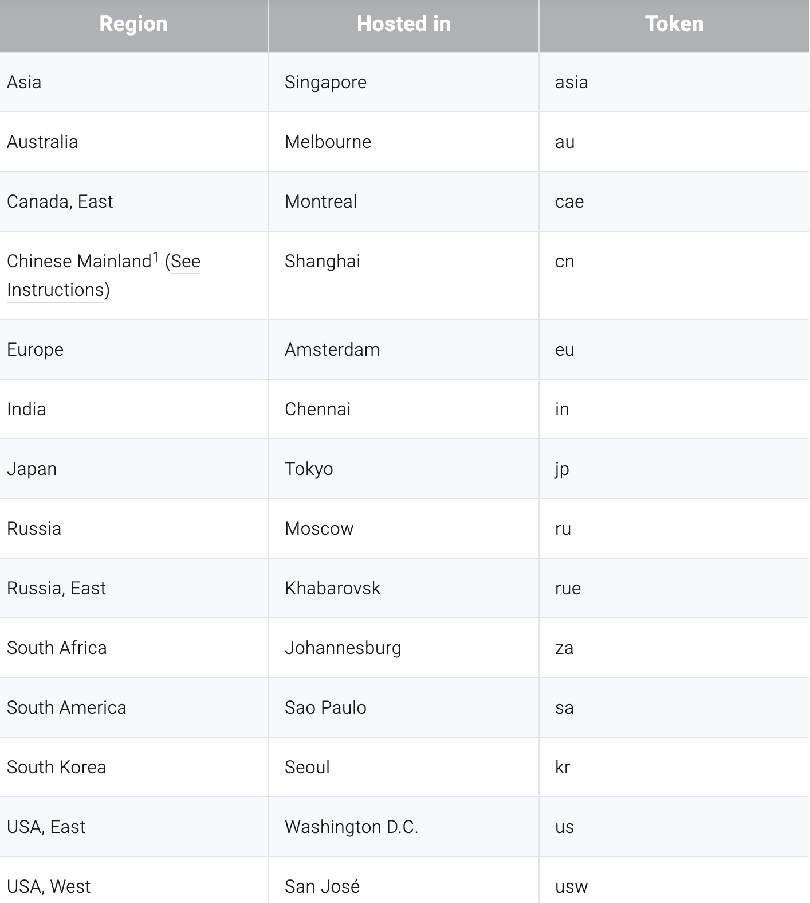

# Photon Realtime Transport for MLAPI

## Setup Photon

Follow the [transport installation guide](../README.md) to add the Photon Realtime Transport to your project.

---

Once added, please follow the following steps

1. Access Wizard from Window → Photon Realtime → Wizard

2. Click next until you get to the Photon Cloud Setup Part

3. To complete the setup, you need a "Photon Realtime" AppId. If you know yours, enter it and click the Setup button.
    Alternatively, enter your email address and click Setup. If possible, a new Photon account gets created (more information in the [License](/Transports/com.mlapi.contrib.transport.photon-realtime/Runtime/Photon/LICENSE)) and the AppId is fetched. This completes the setup.
    If you already got a Photon account, the Wizard can't fetch the AppId, so click the "Visit Dashboard" button and login to the Dashboard to access your AppIds. 
   
4. If you just created an account  for the first time you need to also create a New Application from Photon's Dashboard

     > **Note:** The Photon Type for this transport is: `Photon Realtime`
     
      
       
5. Once an Application is setup, you will be able to get it's AppID from Photon's Dashboard, copy that to your clipboard
       
    
    > **Note:** To connect others to your Photon Room, the AppId **must be the same** in all clients!
    
    
6. Go back to the Photon Wizard Window of your Unity Project and paste the App Id there
    
    
5. Click on Setup
    
    
6. It should show something like: "Your AppId is now applied to this Project **Done** "
    
    
7. Click on Next, then Done, you should be all setup now!
    
8. You can safely quit the Photon Wizard now!

## Preparing Your Project to be built

Follow these steps in order to prepare your Unity to be packaged and distributed to your audience:

---

1. Find `PhotonAppSettings` asset in your project
2. The AppId you've set during the setup, should be shared with your friends in case they want to use the Unity Editor, instead of a packaged built, as each developer might have a different AppId/region set in its PhotonAppSettings asset.
    
    > **Note:** We suggest considering Playing in Editor with your friends only for iteration purposes (when they have access to your project) as we encourage you to distribute your packaged builds to your friends, because sometimes they might have some local changes that would cause different issues.
3. Select the closest region (token) to where you want to host your session from, you can check out a full list here:
    - [https://doc.photonengine.com/en/pun/current/connection-and-authentication/regions](https://doc.photonengine.com/en/pun/current/connection-and-authentication/regions)

    

    > **Note:** As an example, if I would like to host a session/room for players within Europe, then according to the table above the closest location/data centre would be the one from Amsterdam, hence, the token for it is "eu"
4. Once a region token is chosen, put it in the PhotonAppSettings asset of your project in the **Fixed Region** field.
    > **IMPORTANT** All of your friends/users should have the same region set in their PhotonAppSettings asset, otherwise they will not be able to find nor connect to your room/session, in case they are using a Unity Editor.

    

## Before you Build

### Photon Realtime Transport

- Add the `PhotonRealtimeTransport` component to your GameObject containing your NetworkManager.
- Set the `Network Transport` field on the NetworkManager to the `PhotonRealtimeTransport`
- Enter a room name into the `Room Name` field of the `PhotonRealtimeTransport`.
- Use the MLAPI `StartHost` and `StartClient` functions as usually to host a game and have clients connect to it.
  

### Rooms/Matchmaking

While a static room name works fine it will put all your players into the same room. You have to write your own logic to set the `RoomName` property of the `PhotonRealtimeTransport` and share that name with all players interested in joining the same room. There is no built in matchmaking currently.

Documentation about other settings can be found in the [Photon Documentation](https://doc.photonengine.com/en-us/pun/current/getting-started/initial-setup).

# Build it!

Your project should be ready to be packaged and distributed!